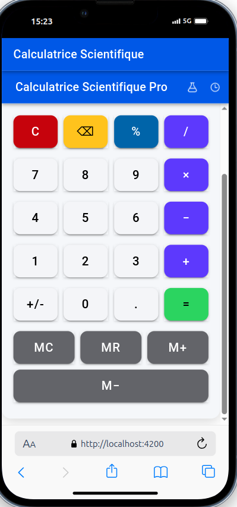
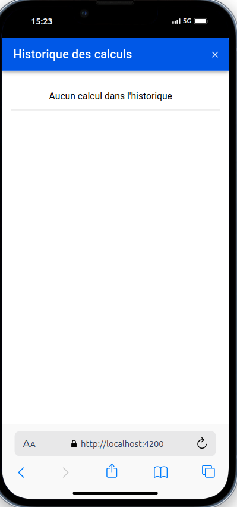

# Ouammou Mourad - Calculatrice Scientifique - Ionic

Une application de calculatrice scientifique développée avec Ionic Framework et Capacitor pour une expérience multiplateforme (Android, iOS, Web).

## 🚀 Fonctionnalités

*   Opérations de base (+, -, ×, ÷)
*   Fonctions scientifiques (sin, cos, tan, log, √, ^, etc.)
*   Mode paysage pour plus de fonctionnalités
*   Historique des calculs
*   Prise en charge des parenthèses et priorités des opérations

## 🛠 Technologies utilisées

*   **Ionic** (UI Framework)
*   **Angular** (ou React/Vue selon votre choix)
*   **Capacitor** (Build natif Android/iOS)
*   **TypeScript** (Langage principal)
*   **CSS** (Styles personnalisés)

## 📥 Installation

### Cloner le dépôt :

```
git clone https://github.com/votre-utilisateur/calculatrice-scientifique-ionic.git
cd calculatrice-scientifique-ionic
```

### Installer les dépendances :

```
npm install
```

### Lancer l'application en mode développement :

```
ionic serve
```

## 📱 Build pour Android/iOS

### Android (APK)

Ajouter la plateforme Android :

```
npx cap add android
```

Build Ionic + Copier dans Android :

```
ionic build --prod
npx cap copy android
```

Ouvrir Android Studio :

```
npx cap open android
```

Puis générer l'APK via **Build > Generate Signed Bundle / APK**.

### iOS (Xcode)

Ajouter la plateforme iOS :

```
npx cap add ios
```

Build Ionic + Copier dans iOS :

```
ionic build --prod
npx cap copy ios
```

Ouvrir Xcode :

```
npx cap open ios
```

Puis compiler pour simulateur ou appareil physique.

## 📸 Captures d'écran

### Fonctionnalités Avancées

Calculatrice avec toutes les fonctionnalités scientifiques avancées.


### Version Simple

Calculatrice avec les opérations de base (simple).



### Historique des Calculs

Affichage de l'historique des calculs effectués.


